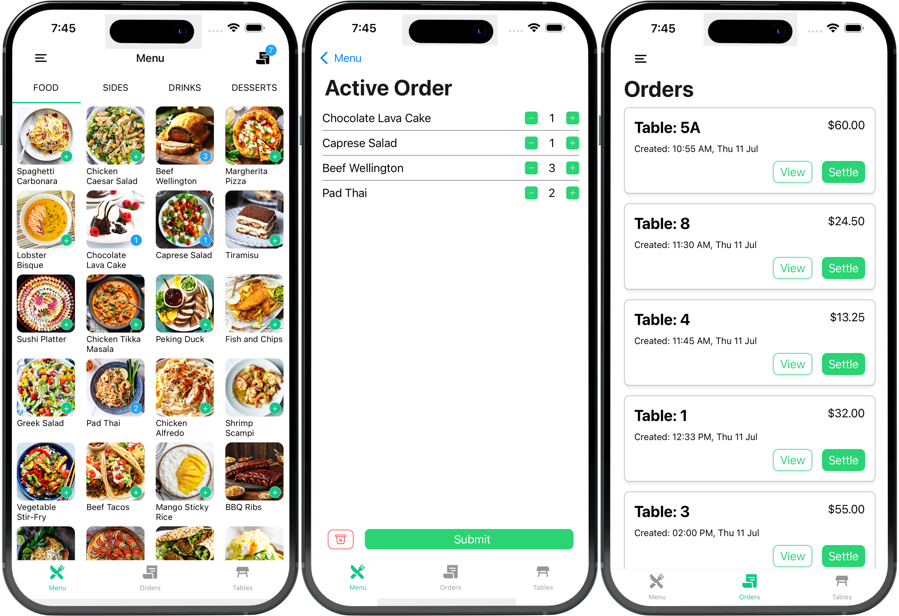

<div align="center">
  
  <p><strong>microPOS:</strong> Point-of-Sales Demo App</p>
</div>

----

<div align="center">
  <a href="https://youtu.be/q99TYA7LnuA">
    
  </a>
</div>

# Overview
Basic POS implementation using Expo and TypeScript.  
Currently writing the backend with Python + Supabase for API functionality.  
All data (menu, orders, etc.) is currently hardcoded. Once the basic MVP layout has been finished, I'll start connecting it with the backend for storage and dynamic data.  

1. Install dependencies
   ```bash
   npm install
   ```

2. Start the app
   ```bash
   npx expo start
   ```

3. Build for native code
   ```bash
   npx expo build:ios
   ```

# To-do
###  Home/Menu Screen
- Finish tabbed sub-menu navigation (e.g. Entrees, Mains, Drinks) [(Example: CoinBase implementation)](https://www.coinbase.com/blog/coinbases-animated-tabbar-in-react-native?source=linkShare-3089be4219ff-1621699865)
   - Generate one-time placeholder backgrounds (currently it's dynamic each time the list re-renders)
- Add sorting functionality

### Active Order Screen
- Dine-in/takeaway toggle
- Total price calculation
- Order details (table, name, total)

### Code/Functionality
- Use variables for list item dimensions
- Subscribing with zustand for order/cart state
- Adding new menu items
- Order submission
- Android compatible context menu for menu items
- Migrate to NativeWind/twrnc for styling
- Light/dark mode

### Unimplemented Screens
- Login/Authentication with Supabase
- Tables [(Example: draggable grid)](https://github.com/SHISME/react-native-draggable-grid)
- Chat
- Settings
- Admin

# Notes
- I broke re-rendering items within the menu list when adding tabs, this will be fixed when I move from hardcoded data
- Current supports iOS and Android (except without context menu functionality)  
- No web support yet